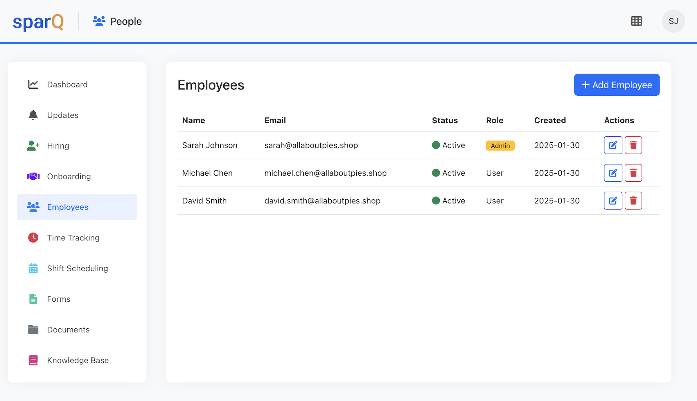

<h1 align="center">
sparQ
</h1>

 
<a href="https://sparqone.github.io">Project Home</a>

  

sparQ is a modular HR/Team Management and general business application platform built with Python and Flask. It provides a flexible, plugin-based 
architecture for managing core business operations, allowing businesses to enable or disable modules based on their needs.  

  
  

[Documentation](https://sparqone.github.io)

## Features

- **Modular System**: Easily extend functionality with independent modules.
- **Dynamic Module Loading**: Modules are auto-discovered and loaded.
- **Extensible Plugin Architecture**: Uses `pluggy` for module integration.
- **Language Support**: Supports multiple languages and user-specific settings.
- **Built-in Core Modules**:
  - **Core**: Authentication, module management, and UI framework.
  - **People**: Employee management, roles, and departments.
- **Additional Modules**:
  - **Books**: Accounting and bookkeeping.
  - **E-Sign**: Digital document signing.
  - **Tasks**: Task and appointment management.
  - **Weather & Clock**: Utility modules (For demonstration purpose)
- **Modern UI**: HTMX for dynamic updates, Bootstrap styling, and responsive layouts.

## Module System

sparQ follows a "building block" approach where functionality is divided into independent modules.

[How to write a new module - (Applications and Extensions)](https://github.com/sparqone/sparq/blob/master/docs/Write%20a%20module%20-%20App.md)

## Security
- User authentication and role-based access control.
- Admin privileges for module management.
- Secure session management.

## Roadmap
- Additional business modules
- Enhanced API integration
- Mobile app support
- Customization options
- 

## License
sparQ is released under the Apache-2.0 license

## Contributing
We welcome contributions! Please submit issues or pull requests on [GitHub](https://github.com/sparqone/sparq).

## Contact
For questions or support, reach out to [asim95@gmail.com](mailto:asim95@gmail.com).

